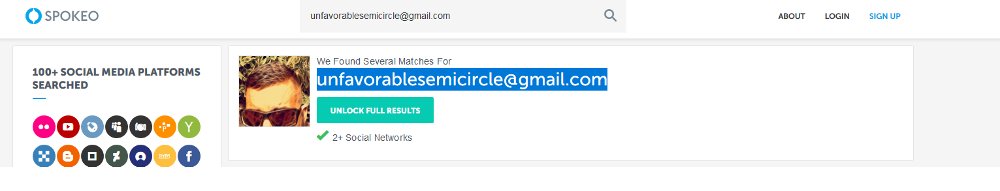
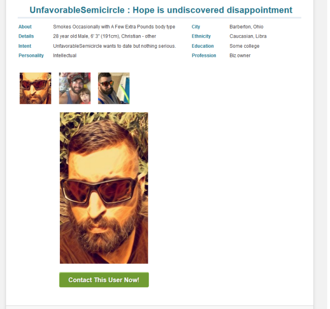

# Spokeo selfie

Discord user Parogar found a selfie-type image (via
[spokeo.com](http://spokeo.com)) allegedly associated with the email
**unfavorablesemicircle@gmail.com**.

Note that the website could have just been showing a random picture as a
strategy to sell the full service to possible customers (instead of a
message "no related images found") - if that's the case, the image
itself is useless and could be completely random.

As of January 2020, it was proven that the image comes from a dating
site and a profile registered under unfavorablesemicircle@gmail.com. The
dating site requires email verification, which makes this image a real
photo of the creator

-----

This profile was found on the dating site Plenty of Fish:

