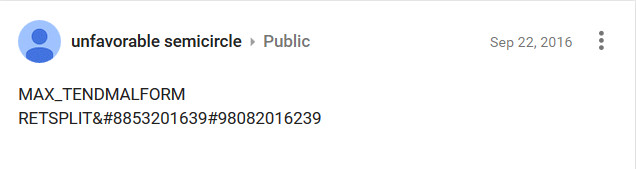

# Stabilitory newing

Stabilitory newing is a YouTube channel that started posting videos on
September 3, 2016. The relationship between Stabilitory newing and UFSC
is currently unclear, but is related to UFSC by the [Third Google+ post](Google_Plus#G.2B_post_3 "wikilink"):

  - 9808 is the unicode codepoint for ♐ in decimal, while 8853 is the
    unicode codepoint for ⊕, which is the leading character in the
    titles of Stabilitory newing's posts.
  - The date 2016-09-03 is the date of the first video posted the
    channel, named ⊕[BROTHER](BROTHER "wikilink") 0;
    ♐[BROTHER](BROTHER "wikilink") 0 was posted to UFSC's main channel
    on 2016-09-23, the second date in the G+ post.

URL: <https://www.youtube.com/channel/UCEUj7apDhQq5hh87U8iP4-w/videos>

The Channel Join date is Aug 24, 2016
[Source](https://www.youtube.com/channel/UCEUj7apDhQq5hh87U8iP4-w/about)

## Videos

  - In September 2016, the channel initially posted a series titled
    ⊕[BROTHER](BROTHER "wikilink"), which consisted of 55 videos.
  - On May 17, 2017, a standalone video named ⊕[RATE](RATE "wikilink")
    was posted.
  - Later that same day, the ⊕[BELT](BELT "wikilink") series began.

## Possible significance of name

Anagrams of "stabilitory newing":

  - "initial bytes wrong"
  - "login is betray twin"
      - "Twin" could be a reference to the zodiac sign Gemini, which is
        the opposite sign to Sagittarius ('Betrayed by the Twins?')

## Work on finding information in the visuals

[Notes on some ideas on treating the "histograms" as a source of data.](http://www.unfavorablesemicircle.com/wiki/Investigation_into_color_data_in_SN_visuals)

## Removal

The Twitter account was deleted (apparently by the author(s)
[Unfavorable Semicircle](Unfavorable_Semicircle "wikilink") itself) at
the time ♐[RESET\_STRANGE\_YD](RESET_STRANGE_YD "wikilink") was
uploaded.

