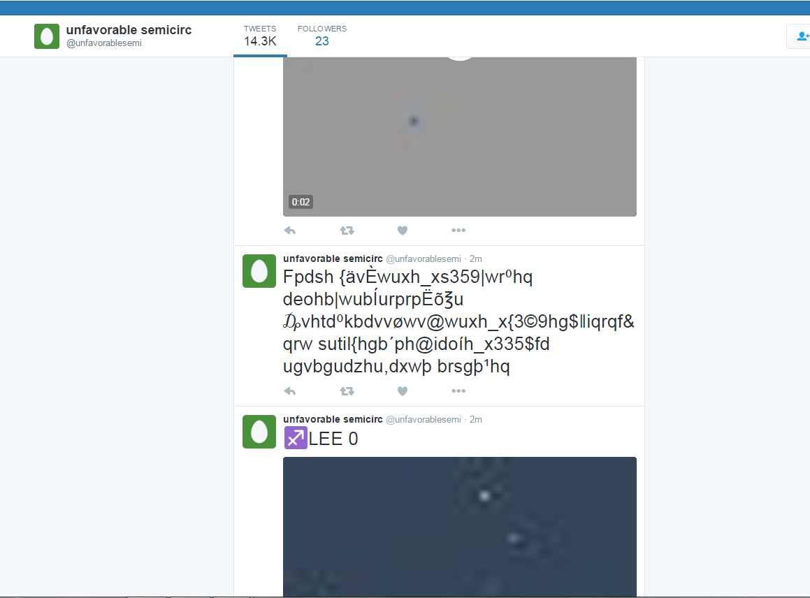

[@unfavorablesemi](https://twitter.com/unfavorablesemi) or
@Unfavorablesem is a twitter account associated with the creator(s) of
Unfavorable Semicircle.

## Background and history

### The original account

After the suspension of the original youtube channel, [garbled text](Google_Plus#G.2B_post_1 "wikilink") was discovered on the Google+
page linked with the terminated YouTube account. When decoded, this led
to the Twitter account (and also contained a link to the now-defunct
second YouTube account.

When discovered, the twitter account was posting a series named
♐[EL](EL "wikilink"). Other series would follow, namely
♐[RIA](RIA "wikilink"), ♐[LEE](LEE "wikilink"),
♐[CAB](CAB "wikilink"), ♐[MUL](MUL "wikilink"), [an unnamed
series](April_10_twitter_series "wikilink"), ♐[NIL](NIL "wikilink"),
♐[DEPTH](DEPTH "wikilink"), ♐[POINT](POINT "wikilink"). There were
also some non-series tweets.

Because of the nature of the platform, finding older material was
difficult, and not all of the older series were fully preserved.

After the end of the ♐[POINT](POINT "wikilink") series on February 13th,
2017 no further tweets were posted.

### A "strange reset"

On September 15, 2017 a video named ♐[RESET STRANGE YD](RESET_STRANGE_YD "wikilink") was posted on youtube. Shortly after
that, the unfavorablesemi YouTube channel, the stabilitory newing
YouTube channel and the Twitter account were manually closed.

### The reactivated account

On 3:48 PM EST, November 25th 2017 the @unfavorablesemi twitter account
was re-activated. Given that a new twitter account can be opened with
the name of defunct account by any user thirty days after the account
was closed, it is unclear if the controller(s) of the account are now
the same as previous or if they merely claimed an available username.

The reactivated account
[tweeted](https://twitter.com/unfavorablesemi/status/934524815863701504)
for the first time that same day, issuing a cryptic message that read
**AnXbE+\>6N"DfSH(1&**:

This account is most likely fake, as shown in the 4th Google Plus post.

(*see [November 25th tweet](November_25th_tweet "wikilink") for more
information*.)

On December 6, 2017, the account began posting new videos in a short
series named ♐[FMI](FMI "wikilink") and a standalone video named ♐[DDR
DONE](DDR_DONE "wikilink"). It was followed on December 9th by a "double
series" named ♐[SECOND](SECOND "wikilink").

It remains unclear if the reactivated account is "authentic", although
its content (especially the detailed composite generated by the ♐SECOND
series) contains many familiar elements.

### Not "REAL"?

The [fourth G+ post](Google_Plus#G.2B_post_4 "wikilink") contained a
list of accounts that were designated as "♐REAL", listing
"TW\_@unfavorablesemiUNTL91517". This has been interpreted to mean that
the original Twitter account was real until 9/15/17, the date of the
[Reset](RESET_STRANGE_YD "wikilink").

The same post also contains a link to a new twitter account,
[@unfavorablesem](https://twitter.com/unfavorablesem). Nothing has been
posted from this account yet.

On April 24, 2019 discord user alexmagnus observed that the
@unfavorablesemi twitter account had been deleted/suspended.

## Posting patterns

Posts to the twitter account typically involve rapid bursts of uploads,
followed by periods of inactivity. It is surmised that this is because
of limitations on the maximum number of tweets allowed per day. (*please
elaborate\!*)

## Unusual/unique tweets

  - On March 18, 2016, ♐[REDLOC](REDLOC "wikilink") was "announced"
    (around the same same time it was posted to youtube) with a tweet
    consisting only of its title.

*Screencap of twitter account by reddit user SuckItWhoville*

  - On March 19, 2016, a string of garbled text was tweeted ([original link](https://twitter.com/unfavorablesemi/status/711024340754669568)),
    reading:

> Fpdsh {ävÈwuxh\_xs359|wr⁰hq
> deohb|wubÍurprpËõ℥u₯vhtd⁰kbdvvøwv@wuxh\_x{3©9hg$‖iqrqf\&qrw
> sutil{hgb´ph@idoíh\_x335$fd ugvbgudzhu,dxwþ brsgþ¹hq

*Screencap of garbled tweet by reddit user SuckItWhoville*

(*see also the reddit discussion
[here](https://www.reddit.com/r/UnfavorableSemicircle/comments/4b1ijr/as_of_an_hour_ago_the_uploads_stopped_10_minutes/)
and
[here](https://www.reddit.com/r/UnfavorableSemicircle/comments/4d3e29/garbed_tweet_demystified/)
on discovering and decoding that tweet via Caesar cipher.*)

*Posted on New Year's Eve, discovered to be a link to the new YouTube
channel*

*First tweet of the post-reset account*

## "foffy-cotton"

Discord user extra has observed that the debug info in tweets from the
reactivated account contain this information:

> "source":
> "<a href=\"http://placehold.er\" rel=\"nofollow\">foffy-cotton</a>",

It is currently unclear to what what "foffy-cotton" is referring.
