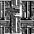
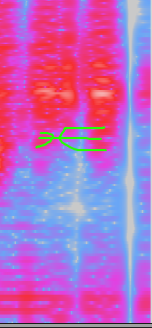
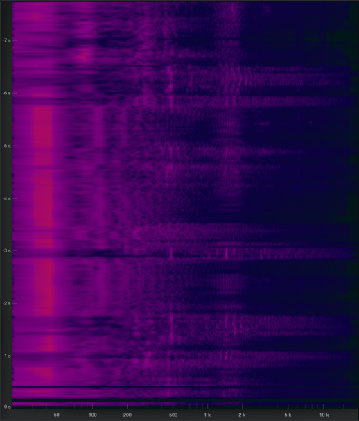

# ♐UPRIGHT
♐UPRIGHT is a video that was posted to the second youtube account on
January 7th 2017.

*animated gif based on ♐UPRIGHT video by parsec*

## Content
The video is only 12 seconds long and consists of an animation of
vertical and horizontal, greyscale lines moving in a seemingly random
pattern.

### Analysis
Discord users StrugLove and ShadowMorphyn have pointed out that the
lines seem to make up a pattern in the form of a person from the
shoulders up, like a webcam user or a news anchor. It has also been
pointed out that in the middle of the video the whole screen goes gray,
and the lines come back in a fashion similar to a .gif or video that has
too few
[I-frames](https://en.wikipedia.org/wiki/Video_compression_picture_types).

## Audio
A distorted [Handshake](Handshake) can be heard at the end. `Lukidot` also mentions the start of the audio is similar to sounds in [Delock](DELOCK).

### Audio Analysis
Discord user Risto observes, "♐UPRIGHT is a strange one. The higher
pitched noise either sounds like a really bad flute, or a Floppy Disk
Drive. There is no handshake per se at the end of the audio: there's a
partial similar structure, but that is the only thing that matches the
handshake."

*incomplete handshake spectrograph by Risto*

Risto further observes: "at the exact end of the audio, denoising the
thing in audacity has revealed an audible **mouse click** at the end.
Which is something that audacity does when you stop recording with it,
as the delay makes the click record itself. And that makes me suspect
that ♐UPRIGHT's audio is in fact a recording of someone probably
attempting to play flute or a weird FDD that was obscured with loud
rumble."

Discord user alexbassguy has also shared this spectrogram, noting "I can
pretty definitively say that there are no voices or anything else hiding
behind the distortion. There is, however, this very unique-looking
sonogram. Looks like it could be a converted image of some kind?"

## Composite
Due to the nature of the video it is not possible to make a composite
with intelligible results. However, as seen at the top of this article,
the whole video has been made into a gif, similar to
♐[DELOCK](DELOCK).

## Time of posting
This video broke with UFSC's usual posting pattern, where a non-series
video would be posted, a day or two before a new series begins (or an
[old one continues](http://www.unfavorablesemicircle.com/wiki/index.php/BROTHER)).
In contrast, this video was posted after ♐[STEM](STEM),
another non-series video. However, this pattern could have been
accidental, in which case the time of posting of this video would be of
no concern.

This video was also relatively "time isolated", appearing after a
month-long gap following ♐[STEM](STEM) and three weeks before
♐[DIAGONAL](DIAGONAL).

  - *see also ♐[LANYARD](LANYARD), which was posted in
    isolation from a series (and has some pulsating visual
    similarities).*

## See also
  - [Max](Max) (software)
