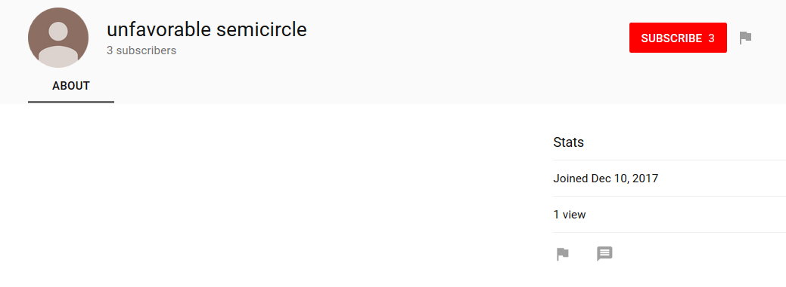

# Un-REAL_UFSC

On
[December 10, 2017](https://www.youtube.com/channel/UCsgRTRJNy05MuB7g2X5ueqg/about)
a youtube channel named "unfavorable semicircle" was launched. Until the
[4th G+ post](Google_Plus#G.2B_post_4) this was generally
referred to as the "3rd youtube channel".

A video named ♐[PORT](PORT) was posted to the channel on
December 31, 2017.

The channel was undiscovered until [cryptic text posted in a tweet](NYE_tweet) that same night was decoded on January 1,
2018 by discord user Peter, with the text
"VUNzZ1JUUkpOeTA1TXVCN2cyWDV1ZXFn" decoding in Base64 to
"UCsgRTRJNy05MuB7g2X5ueqg", the text at the end of this channel's URL.

## Questions of Authenticity

As with the provenance of the reactivated [Twitter](Twitter)
account, there was no solid connection to the "original" author(s) of
UFSC.

On March 27, 2019. the content on UFSC's G+ page was removed, several
days before the service was due to shut down. After that deletion was
noticed, a new [G+ post](Google_Plus#G.2B_post_4) claimed
which accounts are "real". It claimed Twitter, but only UNTL91517
(*i.e.*, until 9/15/17, the date of the
[Reset](RESET_STRANGE_YD)).

The list pointedly did not include the "3rd youtube channel", which has
lead to a general agreement that it is "non-canonical".

This channel was quiet for a full year (including during the time above
when its provenance was not upheld by the "real" announcement) until
posting ♐[FORM](FORM) 0 on December 31, 2019.

## Value/meaning of un-REAL content

Although apparently not the product of the original creator(s) of UFSC,
these videos exhibited a high degree of craft. Whether there is
something concealed within them, and how that might relate to canonical
UFSC content, is currently unknown.

## Videos posted by un-REAL UFSC

  - ♐[PORT](PORT)
  - ♐[RUN](RUN)
  - ♐[NODE](NODE)
  - ♐[SERN](SERN)
  - ♐[ZORO](ZORO)
  - ♐[COEF](COEF)
  - ♐[NEO](NEO)
  - ♐[AZO](AZO) (series)
  - ♐[DIFF](DIFF)
  - ♐[CFO](CFO)
  - ♐[GEN](GEN)
  - ♐[ROOT](ROOT) ("series")
  - ♐[FORM](FORM)
