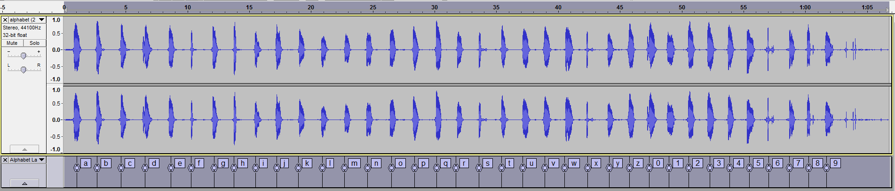
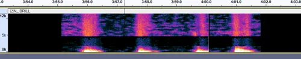

# Unknown Voice
## Overview
The "unknown voice" is present on many of the Unfavorable Semicircle
videos. The voice is male and not synthesized (though presumably
subjected to audio processing). The voice's accent has been subject to
debate — some have said it sounds British, although it says "Zee" rather
than "Zed".

The "lo-fi" quality of the sound suggests that a very rudimentary
microphone is being used: maybe a webcam, built-in laptop mic, or
something similar.

## Trends in Speech
On the first day of videos being posted, all videos were silent. The
voice began to appear after this, albeit far less frequently than it
would
later[https://www.reddit.com/r/UnfavorableSemicircle/comments/46zwat/breakdown\_of\_todays\_findings\_february\_22nd\_2016/1](https://www.reddit.com/r/UnfavorableSemicircle/comments/46zwat/breakdown_of_todays_findings_february_22nd_2016/_1 "wikilink").

It was remarked by reddit user /u/McSweepyPants that until June 12, 2015
that the voice appeared to only (or at least mainly) say either "0" or
"1" around this time. The same redditor later noted that from then until
♐[LOCK](LOCK "wikilink") was posted, there was a good deal of microphone
fumbling (or potentially even a heartbeat sounds) heard over this period
of
time[https://www.reddit.com/r/UnfavorableSemicircle/comments/46zwat/breakdown\_of\_todays\_findings\_february\_22nd\_2016/1](https://www.reddit.com/r/UnfavorableSemicircle/comments/46zwat/breakdown_of_todays_findings_february_22nd_2016/_1 "wikilink").

## Sample of voice
A sample of the "standard" alphabet can be heard
[here](https://clyp.it/ql1rof5n). (There were numerous videos with this
identical soundtrack in the pre-♐[BRILL](BRILL "wikilink") videos in the
original account.)

*waveforms of "standard alphabet", as in the audio file linked above.*

## Audio
> ben's fractals: Also for those voices that say numbers and letters i'm pretty sure Unfavourable semicircle used the Spectral delete Nyquist command and just removed the mid-area of the speech, leaving behind only the low and high ends
> 
> The frequency where it is removed ranges from about 1.6KhZ to around 4.9Khz

## Videos Containing the Unknown Voice
*an incomplete list!*

* [Original unnamed series](Original_unnamed_series "wikilink")
* ♐[BRILL](BRILL "wikilink")
* ♐[LOCK](LOCK "wikilink")
* ♐[DELOCK](DELOCK "wikilink")
* ♐[MUL](MUL "wikilink")
* ♐[POINT](POINT "wikilink")
* ♐[DEPTH](DEPTH "wikilink")
* ♐[HARVEST](HARVEST "wikilink")
* ♐[RAPID](RAPID "wikilink")
