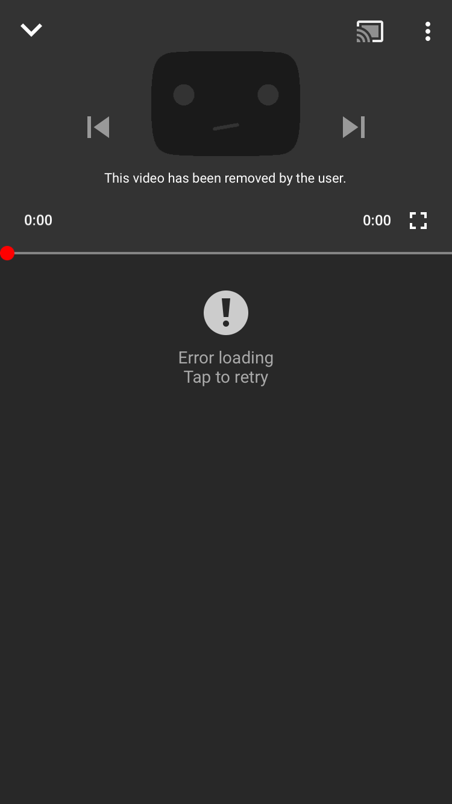
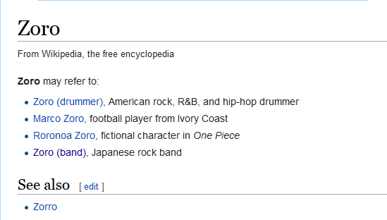

♐ZORO was a video posted to the [3rd youtube
channel](3rd_youtube_channel "wikilink") account on March 26, 2018. The
video was removed by the uploader immediately after it was posted —
youtube alerts were sent out, but the video was gone by the time the
channel was accessed. The video was uploaded/removed two months to the
day after ♐[SERN](SERN "wikilink"), the previous upload.
♐[COEF](COEF "wikilink") would be posted (and not immediately deleted)
three days after this.

*youtube notification received by discord user A Hidden Waffle*

*missing video screencapped by discord user A Hidden Waffle*

*youtube notification received by discord user Ryallin*

## Significance

It is currently unclear if the video was removed because some sort of
fault had been observed with it by the uploader or if the very name
itself was meant to be a clue or signal and the content irrelevant.

The word "zoro" does not have any strongly-evocative associations in
area commonly associated with UFSC.

It is similar to the word "zorro", which is Spanish for "fox" (as well
as the famous swashbuckling fictional character).
