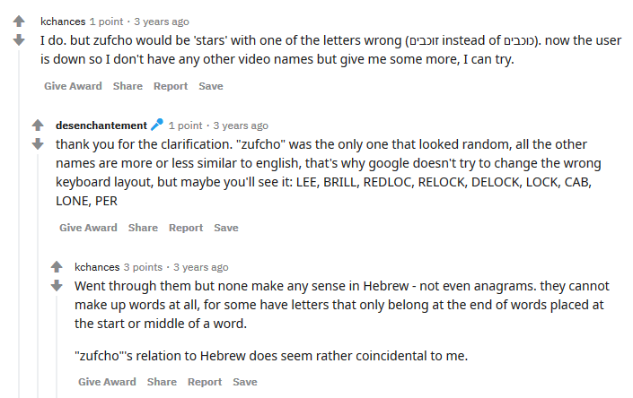

# ZUFCHO

♐ZUFCHO is a video posted to the [second YouTube account](Real_and_Fake_channels) on March 18, 2016. It was
posted after a week-long pause after ♐[REDLOC](REDLOC) and at
the start of a busy period for UFSC, that included
♐[LONE](LONE), ♐[WINGSET](WINGSET),
♐[RETIO](RETIO) and ♐[LIMIT](LIMIT) (as well as
the ♐[CAB](CAB) and ♐[MUL](MUL) series on
twitter).

{{\#ev:youtube|<https://youtu.be/scwHkUmiFPs>}} [Original Link](https://youtu.be/VVUJIxHRHUU)

## Description of video

The video is 0:03 in duration. It contains a stereo audio track. A voice
in left channel speaks an unknown phrase, sounding something like
"azey-kay-yeero". The right channel has the [Unknown Voice](Unknown_Voice) speaking the letter "E" plus the
[Handshake](Handshake).

## Audio

### Analysis of spoken words in Left Channel

One version of the cleaned-up audio of the spoken words can be heard
here:
[Zufcho-cleanup](https://soundcloud.com/blackredanddead/zufcho-cleanup)

Discord user alexbassguy observed, "I have no idea how to go about
finding where \[the spoken words are\] from, but after working with it
much of today, I'm pretty confident that it says 'I will still love
you'." They also provided this cleaned-up version: [Media:ZUFCHO - LEFT CHANNEL CLEANED.wav](Media:ZUFCHO_-_LEFT_CHANNEL_CLEANED.wav). (As
well as the right channel: [Media:ZUFCHO - RIGHT CHANNEL CLEANED.wav](Media:ZUFCHO_-_RIGHT_CHANNEL_CLEANED.wav).)

After further analysis, they observe: "I worked more on the ZUFCHO
mystery and was able to get the voice even clearer I pitched it up and
sped it up slightly, plus did some more EQing and processing to try and
get it clearer... Now it sounds much more like '(Ella?) will still love
you'. I don't think it's an I at the beginning anymore, but the rest of
it sounds pretty damn close." [Media:ZUFCHO - LEFT CHANNEL CLEANED 2.wav](Media:ZUFCHO_-_LEFT_CHANNEL_CLEANED_2.wav)

(This is not a consensus conclusion, and other listeners do not hear the
"love you" in the audio.)

Some Discord users hear the words start as *pay attention*! This would have an important meaning as Zufcho seems to be the first appearance of the Hand-shake, which plays very-shortly after the words are said. The message could then be interpreted as *pay attention to this audio-signal which I'm about to introduce*, as a clue to its importance?

### Other Audio Analysis

Discord user Risto notes that the "right channel has... the handshake at
490 Hz."

## Meaning of title

The meaning of this video's title is unknown.

### The incorrect assumption that "Zufcho" means "star" in Hebrew

Shortly after ♐ZUFCHO's original posting on youtube, this was posted on
reddit:

When it was observed that the image in the
\[<https://he.wikipedia.org/wiki/%D7%9B%D7%95%D7%9B%D7%91>|
Hebrew-language wikipedia article for "Star"\] contained an image of the
[Sagittarius](Sagittarius) Star Cloud, it became
widely-assumed that "zufcho" was Hebrew for "star". (this train of
thought may also have been encouraged by speculation that
♐[REVI](REVI) was also possibly a Hebrew word.)

However, "zufcho" is not Hebrew for "star". (Further research seems to
suggest it's not a word in that language at all, although this reflects
searches on transliterated words like "זופכּוֹ", which may be
incorrectly constructed.) The title word of the Hebrew-language
wikipedia article is "כוכב", which is procounced something like
"ko-*have*".

There were contemporaneous indications that an incorrect assumption had
been made:

However, this was ignored in favour of the fortuitous connection in the
Wikipedia article.

In February 2020, Discord user alexmagnus inquired as to "where does the
notion that zufcho is hebrew for star come from though?" This lead to
some re-investigation clarifying the facts above.

## Contemporaneous Reddit Threads

  - [♐ZUFCHO](https://www.reddit.com/r/UnfavorableSemicircle/comments/4c05ow/zufcho/)
  - [Further ZUFCHO cleanup and de-clipping](https://www.reddit.com/r/UnfavorableSemicircle/comments/4kwptn/further_zufcho_cleanup_and_declipping/)
  - [Does anyone here have Latin-Hebrew keyboard?](https://www.reddit.com/r/UnfavorableSemicircle/comments/4c1cjc/does_anyone_here_have_latinhebrew_keyboard/)
