c# Audio composites

**Audio-sample compositing** is a technique pioneered by Discord user `N25_CT13` in December, 2023 that involves converting the stereo audio channels of Unfavorable Semicircle's videos into images similar to [visual composites](Video_Composites "wikilink") - the core difference being that they are sourced from audio-samples rather than video-frames.

Some of the iconography unveiled through this process has been entirely novel to UFSC's body-of-work, while others seem more familiar. One of the images revealed is the [Hearthstone](Hearthstone "wikilink") video-game icon.

The discovery of these composites seems to contradict the [♐️ANSWERS](ANSWERS "wikilink") tweet that claimed no major discoveries were left to be made in the UFSC investigation. If legitimate, it's also possible that the author was unaware of these images and that they are unintended side-effects of the process used to generate the huge quantity of videos uploaded.

## First composite

> N25_CT13: i dont know if this is useful or not but ive turned [the lock](LOCK "wikilink")'s right audio channel into an image
>
> N25_CT13: i put every sample's value as a pixel color and have set the image width to the amount of samples between repeating noises


## Compositing method

Discord user `Dom` explains the process:

> 1. Convert the audio samples to a black and white image, where sample height corresponds to pixel brightness
>
> 2. Shrink the image horizontally to about 1% of it's original size (we went from 19880 pixels to 200)
>
> 3. Use standard compositing tools to find the correct width
>
> Step #2 is also equivalent to speeding up the video 100x, we think. This is where resampling and interpolation come in.

It has been postulated that since YouTube's encoding would not preserve the exact fidelity of any data encoded in audio samples, it was necessary for UFSC to first slow down the audio before uploading the videos. As such, the audios have to be sped up again to return to their intended form. 

> Dom: I was wrong earlier when I said the audio composites look better at x128. Some do, some don't. The ball and the cube have much better proportions at x100, but less noise at x128.
> 
> I suggested x128 because the audio has a constant buzz of 375 hz, which is a period of exactly 128 samples at 48000 per second. Speeding up the audio effectively applies a low-pass filter that eliminates the buzz.
> 
> I think x100 is the correct scale, but we need to find a better way to de-noise the signal first.

## Other composites

Unless stated otherwise, these are from ♐LOCK.

### By N25_CT13

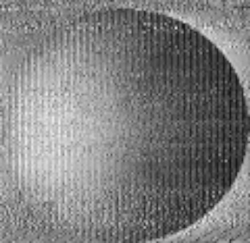
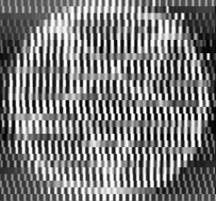
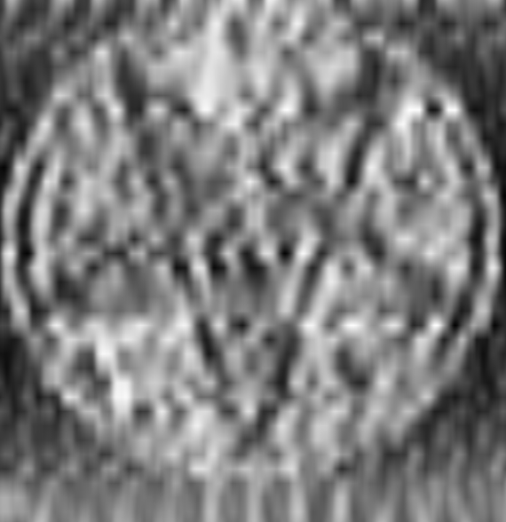
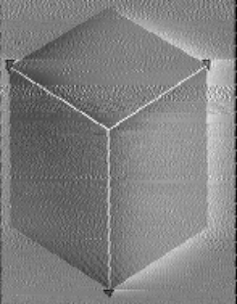

> tukkek: these look nearly identical to some visual composites such as [♐FOND](FOND "wikilink") and [♐GOLDEN](GOLDEN "wikilink")


> N25_CT13: also tried converting [the handshake](Handshake "wikilink")

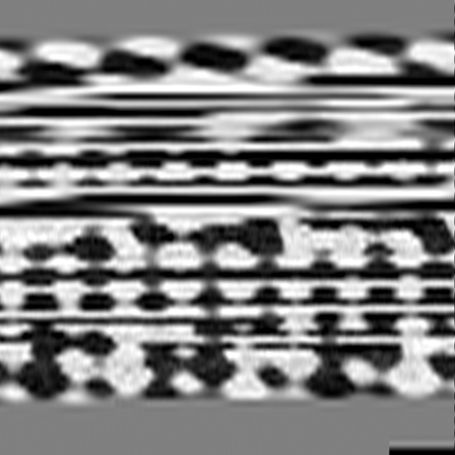

### By Dom

> Dom: Here are the first million samples (20.83 seconds) of LOCK's left channel, generated using the script I linked above. I used the composite tool to reshape it to a width of 1024 pixels. It's interesting to see so much periodicity at this width, since 1024 is a power of two
>
> Dom: There are exactly 1024 (2^10) samples between the peaks in the first section. Then, after about a second of noise in the middle, there are exactly 128 (2^7) samples between peaks. I believe there are 65536 (2^16) samples in each of the repeating clips at the end

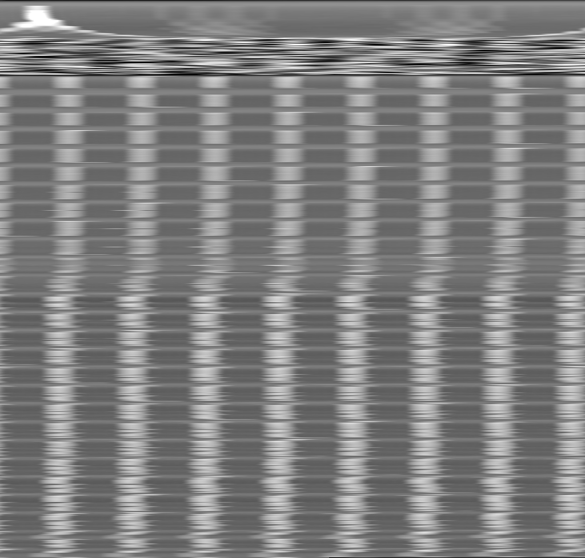

> Dom: No wonder so many people said LOCK sounds like a printer. The waveform is literally forming this image line by line

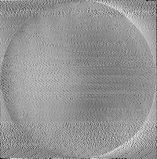

> Dom: nteresting gradient from the left channel audio composite of LOCK, at ~25:41

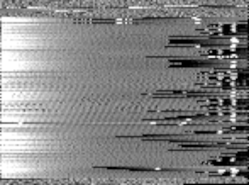

> Dom: I've been focusing on the pentagrams lately. There are 3 different spots where they can be heard: 4:30, 5:17, and 9:01. Each instance has 3-5 pentagrams at different scales, which gives us a lot of data.
> 
> I think if we try overlaying the pentagram samples, we can eliminate the noise and get a better idea of how to denoise the other images
> 
> The pentagram array sample at 4:30, the other two look the same:

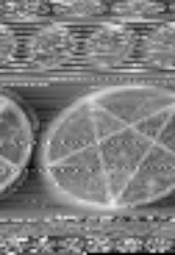

> Dom: the three pentagrams featured in the array, each is visible at a certain composite width: 63, 42, and 21 pixels

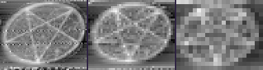

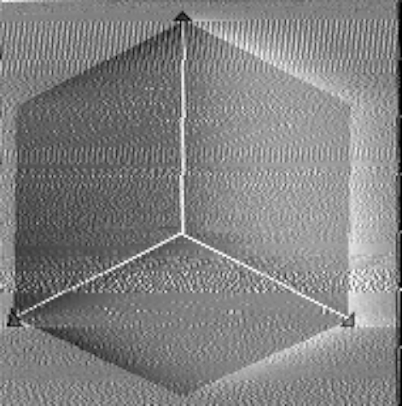

### Hearthstone compass

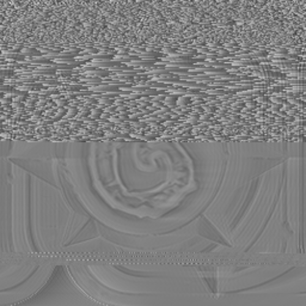

> Dom: Here's a cleaned up version I just made. I lined up the top and bottom half by hand and inverted the colors. The stripe about 1/4 of the way down is where the letters "L, O, C, K" are read

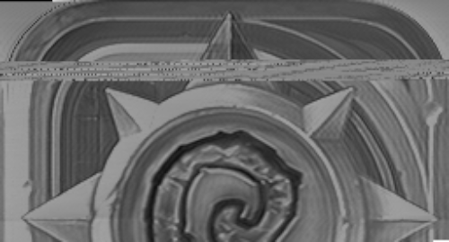

### Possible text section

> tukkek: these are letters aren't they? pretty sure i see a couple As and Ds, a C and a F - all in two very clear, pixel-perfect lines of text

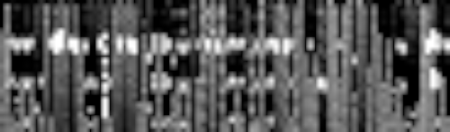

> tukkek: the resizing is not ideal but: A on the bottom left, Ds on the right, everything aligned pixel-perfectly 

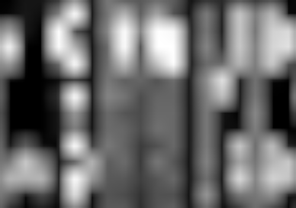

> tukkek: AF?

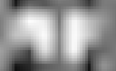

### By Elbe

> Elbe: left audio channel, clear extraction
>
> So I loaded the entire wav as a numpy array, then I split the thing into small arrays of length 128 (the distance between each peak) with an offset of 64 (gives lowest standard distribution of length between peaks -> one window should contain only one peak) and then on each window the maximum is the peak and the average of the minimum 5%-25% (so outlier that are lower are skipped and only the low values are taken, so we do not use the peak) of entries are the baseline. Finally just subtract peak from baseline (to get the difference in signal) and plot that (and baseline and peaks also)
>
> peaks-baseline, peaks and baseline:

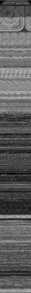 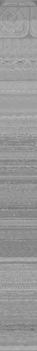 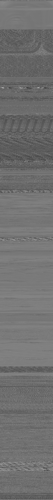

## Executable file theory

Discord user `noxxy` presents the idea that the images being seen could be embedded media on an executable file:

> there's a bunch of relatively recognizable images being found between what seems to otherwise be just a mess of data. yknow what else does that? executable files!
>
> that is to say, if there's recognizable images, perhaps the stuff between is other data? 
>
> here's the executable of a little game called rocks'n'diamonds being imported as raw data into GIMP for instance, with the relatively simple yet recognizable icon clearly visible. note how the icon above also seems to be stored upside down!

Executables can embed other media in them (like other files) so they can be distributed and managed more easily as a single file when preferred. In particular, embedded icons are used as a way to display a custom image to users of the program.

These icons have a variety of sizes in them, so that the operating system can choose the best version to show depending on the display resolution and context (such as a larger desktop icon or a smaller file-browser list-view item). Since automatic resizing of icons can generate poor results, developers are recommended to provide the differently-sized icons themselves.

> N25_CT13: also i think the star is an .ico file since it repeats itself so many times

## Doom 3 icon

In June 2024, Discord user `Fufeng Industries` noted:

> Fufeng Industries: This pentagram is so very similar to the icon for the Doom 3 game. It would make even more sense if it is an .ICO file, and thus has three resolutions.
> 
> Fufeng Industries: Well when someone here mentioned it could be an ICO file, this was the first place my mind went. Doom 3 is the only game that has a pentagram for an icon, and it is also an upside-down pentagram, and the star has those "shiny" points, which I can also see in the LOCK composite.
> 
> Fufeng Industries: As someone who did play (and very much loves) Doom 3, there are recurring themes of machinery and computers being possessed by ghosts and demons. The ambience is very detailed and is a gold mine for finding spooky sound effects. Last but not least, the plot is centered around decrypting an alien message.

Discord user `tukkek` created a high-lighted comparison of the game icon and the composite pentagram:

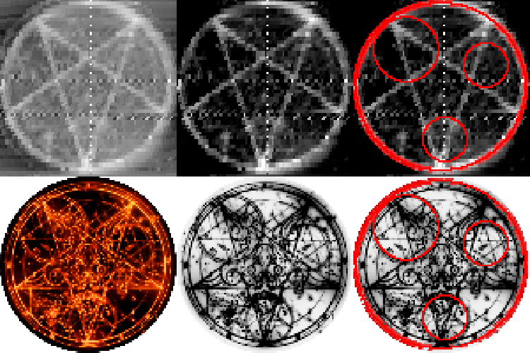

Like the previously-found mobile Hearthstone icon, *Doom 3* is also available on mobile devices.

> yam00: mf literally trying to run Doom on youtube

## See also

- [Composite visual overview](Composite_visual_overview "wikilink")
- [♐MOTH](MOTH "wikilink") and [⊕RATE](RATE "wikilink"), which Discord user `noxxy` suggests as potential targets for further investigation
- Discord user `Mike & Rich` claims "[Stabilitory Newing](Stabilitory_newing "wikilink") has the same sort of printer sounds"

## Scripts

[By Elbe](audio_composites_LOCK_left.zip "wikilink").

### By Dom

> It only works with WAV files and it only does audio->image conversion, not resampling or "squishing". If you use another program to speed up and convert the audio, and then put the output from this script into a composite tool, you may get some results.

```py
#!/usr/bin/env python3

import cv2
import numpy as np
import math
import sys
import wave

# audio_2_image.py
#
# Input file must be in WAV format!
#
# Usage: python3 audio_2_image.py [options] <input_file>
# Options:
#     -l          Select left channel
#     -r          Select right channel
#     -w <width>  Specify width

def main():
    input_file = None
    select_left = True
    select_right = True
    width = -1

    # Parse command line arguments
    if len(sys.argv) <= 1 or sys.argv[1] == '-h':
        print('Usage: python3 audio_2_image.py [options] <input_file>\n' + 
              'Options:\n' +
              '    -l          Select left channel\n' +
              '    -r          Select right channel\n' +
              '    -w <width>  Specify width')
        return
    i = 1
    while i < len(sys.argv):
        arg = sys.argv[i]
        if arg == '-l':
            select_right = False
            if select_left == False:
                print('ERROR: Cannot use both -l and -r at once')
                return
        elif arg == '-r':
            select_left = False
            if select_right == False:
                print('ERROR: Cannot use both -l and -r at once')
                return
        elif arg == '-w':
            i += 1
            if i == len(sys.argv):
                print('ERROR: Must specify a number after -w')
                return
            else:
                try:
                    width = int(sys.argv[i])
                except ValueError:
                    print('ERROR: Must specify a number after -w')
                    return
                if width <= 0:
                    print('ERROR: Width must be greater than 0')
                    return
        else:
            if input_file == None:
                input_file = arg
            else:
                print('ERROR: Unknown token or duplicate file name:', arg)
                return
        i += 1
    if input_file == None:
        print('ERROR: No input file given')
        return

    # Open input WAV file
    try:
        w = wave.open(input_file, 'rb')
    except wave.Error:
        print('ERROR: Input file must be in WAV format')
        return
    except FileNotFoundError:
        print('ERROR: File not found: ' + input_file)
        return
    number_of_channels = w.getnchannels()
    number_of_frames = w.getnframes()
    sample_width = w.getsampwidth()
    if number_of_channels > 1:
        print('%s: %d frames, %d channels' % (input_file.split('/')[-1], number_of_frames, number_of_channels))
    else:
        print('%s: %d frames' % (input_file.split('/')[-1], number_of_frames))

    # Calculate output array size
    if width == -1:
        width = math.ceil(math.sqrt(number_of_frames))
    height = math.ceil(number_of_frames / width)
    if width >= 32767 or height >= 32767:
        print('WARNING: Output dimension greater than 32,767. File might not save properly.')

    # Create output arrays
    left = None
    right = None
    if number_of_channels == 1:
        if select_left == False or select_right == False:
            print('Audio is mono, ignoring channel selection')
        select_left = True
        select_right = False
    if select_left:
        left = np.zeros(dtype=np.uint8, shape=(height, width, 1))
    if select_right:
        right = np.zeros(dtype=np.uint8, shape=(height, width, 1))

    # Print starting text
    if select_left and select_right:
        print('Writing to left.png AND right.png at %dx%d' % (width, height), end='', flush=True)
    elif select_left:
        print('Writing to left.png at %dx%d' % (width, height), end='', flush=True)
    else:
        print('Writing to right.png at %dx%d' % (width, height), end='', flush=True)
    tenth_interval = number_of_frames // 10

    # Read all audio samples to image array(s)
    for n in range(number_of_frames):
        frame = w.readframes(1)
        if select_left:
            left_sample = int.from_bytes(frame[0:2], byteorder='little', signed=True)
        if select_right:
            right_sample = int.from_bytes(frame[2:4], byteorder='little', signed=True)

        # Convert from 16-bit signed (-32,768 to 32,767) to 8-bit unsigned (0 to 255)
        if select_left:
            left_sample = int(((left_sample/32768) + 1.0)*128)
        if select_right:
            right_sample = int(((right_sample/32768) + 1.0)*128)

        x = n % width
        y = n // width
        if select_left:
            left[y, x] = left_sample
        if select_right:
            right[y, x] = right_sample

        if n % tenth_interval == 0:
            print('.', end='', flush=True)

    print('DONE')

    # Write image(s)
    if select_left:
        cv2.imwrite("left.png", left)
    if select_right:
        cv2.imwrite("right.png", right)

if __name__ == '__main__':
    main()
```

> I just finished a script to repair the clipping in LOCK. The amplitude has been decreased to 1/4 to make room for the peaks, so we've lost a little precision, but we can now see data values that were previously clipped to pure white.

```py
#!/usr/bin/env python3

import cv2
import numpy as np
import math
import sys
import wave

def main():    
    win = wave.open('LOCK_left.wav', 'rb')
    number_of_channels = win.getnchannels()
    number_of_frames = win.getnframes()
    sample_width = win.getsampwidth()

    wout = wave.open("out.wav", "wb")
    wout.setnchannels(1)
    wout.setsampwidth(2)
    wout.setframerate(48000)
    
    cutoff = 32768 - 16
    scale = 0.25

    clip_size = 0
    counter = 0
    prev_samples = [0]*2048
    for n in range(number_of_frames):
        frame = win.readframes(1)

        sample = int.from_bytes(frame, byteorder='little', signed=True)

        if sample >= cutoff or sample <= -cutoff:
            clip_size += 1
        else:
            if clip_size > 0:
                counter += 1
                if counter == 2:
                    start_slope = prev_samples[-2*2 - clip_size + 2] - prev_samples[-2*2 - clip_size + 1]
                    start_slope *= clip_size + 1
                    end_slope = sample - prev_samples[-2 + 1]
                    end_slope *= clip_size + 1
                    a = start_slope + end_slope
                    b = -2*start_slope - end_slope
                    c = start_slope
                    for m in range(clip_size):
                        x = (m + 1)/(clip_size + 1)
                        #ramp_sample = min(prev_samples[-2*2 - clip_size + 2] + start_slope*x, 2*cutoff)
                        poly_sample = a*x*x*x + b*x*x + c*x + prev_samples[-2*2 - clip_size + 2]
                        poly_sample = min(poly_sample, 2*32768 - 1)
                        #sin_sample = 32767*(0.5 + 0.5*math.sin(3.1415*m/(clip_size - 1)))
                        #sin_sample = cutoff
                        wout.writeframes(max(-32768, min(32767, int(scale*poly_sample))).to_bytes(2, 'little', signed=True))
                    for m in range(2 - 1):
                        prev_sample = prev_samples[-2 + m]
                        wout.writeframes(int(scale*prev_sample).to_bytes(2, 'little', signed=True))
                    wout.writeframes(int(scale*sample).to_bytes(2, 'little', signed=True))
                    #print(n, clip_size)
                    clip_size = 0
                    counter = 0
            else:
                wout.writeframes(int(scale*sample).to_bytes(2, 'little', signed=True))
    
        prev_samples.append(sample)
        prev_samples.pop(0)

    win.close()
    wout.close()

if __name__ == '__main__':
    main()
```

### By ShinyQuagsire

> ooh I managed to pull out more detail
> 
> there are more icons underneath

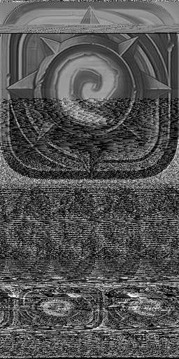

> https://gist.github.com/shinyquagsire23/383450a11b81d3c952599af9f633ceb3
> 
> `python3 lock_decode.py -l -w 256 Downloads/lock_audio_s16.wav`
