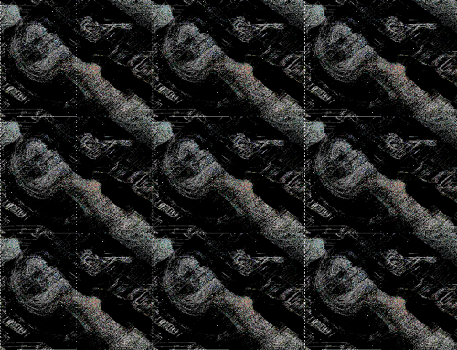
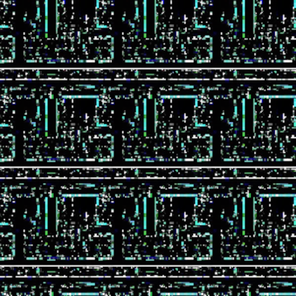
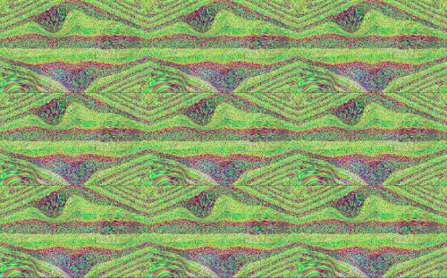

# Recursive composites

Some of the [video composites](Video_Composites) have a recursive quality, which Wikipedia defines as:

> **Recursion** occurs when the definition of a concept or process depends on a simpler or previous version of itself.

While most of the recursive composites are crude and likely happenstance (such as bands of color happening to match vertically whan placed side-by-side), others are sophisticated to the point they are recursive on both axis, even having forms appear across boundaries, depending on the recursion itself to complete an object.

While some can be immediately apparent, others may require slight alterations to achieve a (mostly) seamless grid pattern (such as pixel-shifting to correct their angle).

Here are known examples in [♐BROTHER](BROTHER) and [♐REDLOC](REDLOC):

Also [♐CFO](CFO), which was uploaded by [the Unreal channel](Un-REAL_UFSC):

